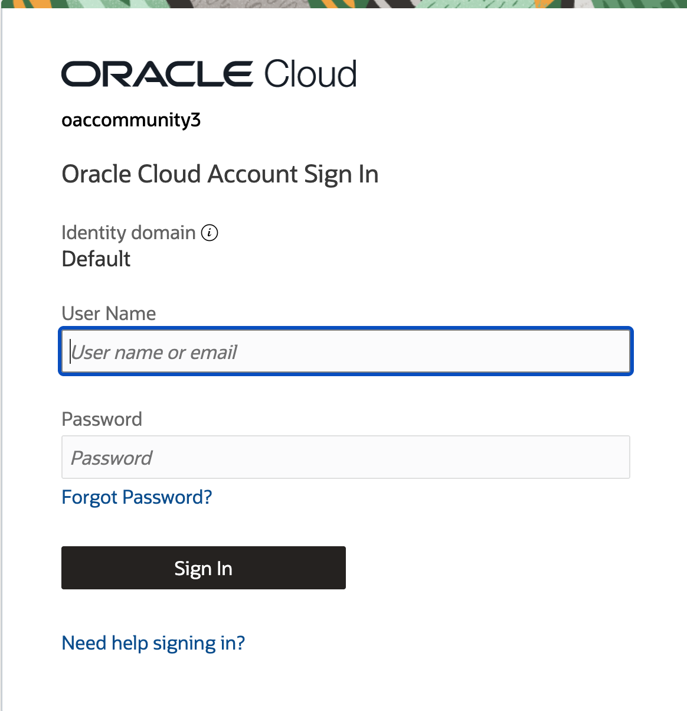
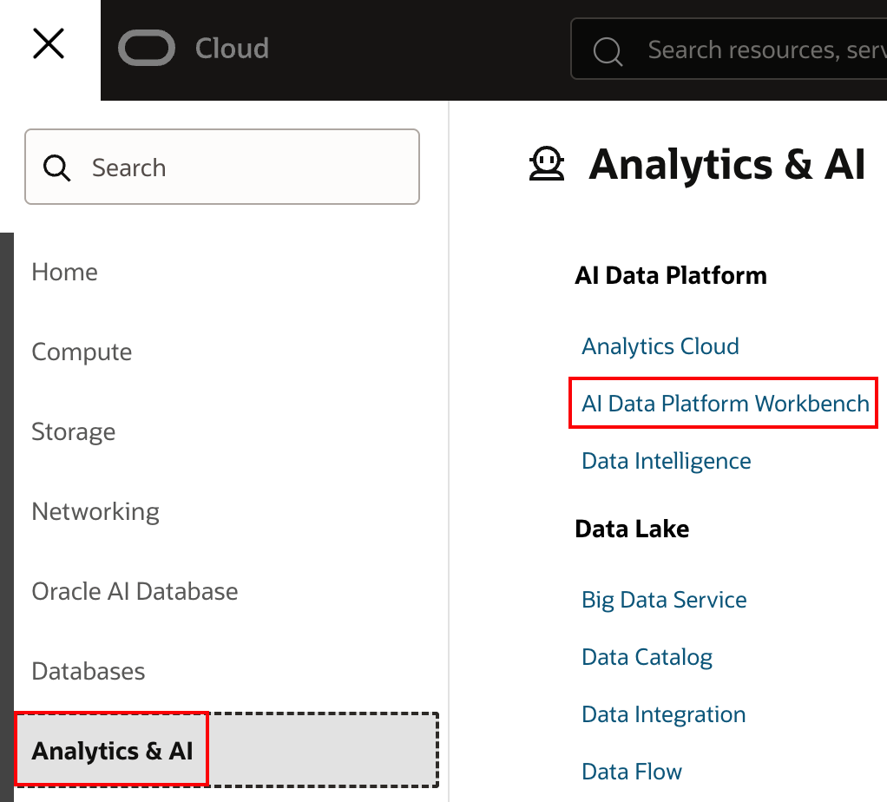
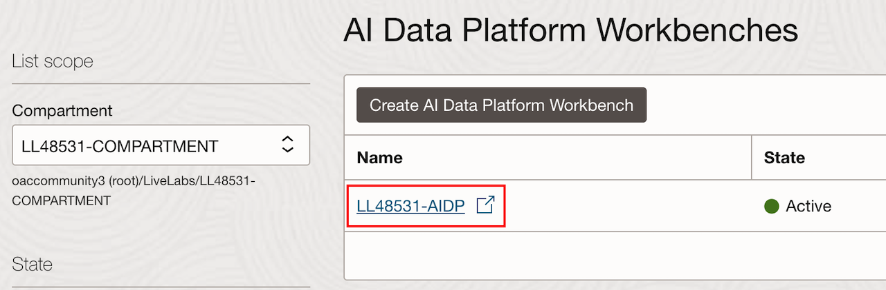

# Access AIDP Instance and Lab Files

## Introduction

In this lab you will navigate the OCI console to locate your AIDP instance. From there, you will download the lab files and continue from this point using the lab guide.

Estimated Time: 10 minutes

### Objectives

In this lab, you will:

- Access your AIDP instance.
- Continue from here with the lab guide

### Prerequisites

This lab assumes you have:

- An Oracle Cloud account.

## Task 1: Login to OCI and Access your AIDP Instance

1. Using the credentials supplied with your reservation, login to the OCI console, you will be prompted to reset the password.

    

2. From the OCI Console homepage, select the Navigation Menu, navigate to **Analytics and AI**, and select **AI Data Platform Workbench**.

    

3. Use the compartment dropdown on the left to choose the compartment associated with your reservation. Expand the root compartment (oaccommunity3), the **Livelabs** compartment, then select your compartment.

    

4. You should see a single AIDP instance appear on the page. Select its name to access the AIDP homepage.

## Task 2: Access Lab Files

1. Now that you are set up in your AIDP instance, [click this hyperlink to download the lab files](https://axqurh31kd2o.objectstorage.us-ashburn-1.oci.customer-oci.com/n/axqurh31kd2o/b/Green-Button-Lab-Instructions/o/lab-files.zip). Unzip the files and open the lab-guide.pdf file. Follow the instructions in that document to complete the lab.

## Learn More

- [Oracle AI Data Platform Community Site](https://community.oracle.com/products/oracleaidp/)
- [Oracle AI Data Platform Documentation](https://docs.oracle.com/en/cloud/paas/ai-data-platform/)
- [Oracle Analytics Training Form](https://community.oracle.com/products/oracleanalytics/discussion/27343/oracle-ai-data-platform-webinar-series)
- [AIDP Workbench Creation Documentation](https://docs.oracle.com/en/cloud/paas/ai-data-platform/aidug/get-started-oracle-ai-data-platform.html#GUID-487671D1-7ACB-4A56-B3CB-272B723E573C)
- [AIDP Workbench Master Catalog Documentation](https://docs.oracle.com/en/cloud/paas/ai-data-platform/aidug/manage-master-catalog.html)
- [Permissions for AIDP Workbench Creation](https://docs.oracle.com/en/cloud/paas/ai-data-platform/aidug/iam-policies-oracle-ai-data-platform.html#GUID-C534FDF6-B678-4025-B65A-7217D9D9B3DA)

## Acknowledgements
* **Author** - Miles Novotny, Senior Product Manager, Oracle Analytics Service Excellence
* **Last Updated By/Date** - Miles Novotny, August 2026
